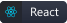

<h2>Hello, world! 👋</h2>

I'm Gabriel Eringer, a Full Stack Developer with a deep passion for technology, especially in **Front-end** and **UX/UI Design**. 

  
<h2>👨🏻‍💻 About Me</h2>

  
  - :rocket: My focus is on **Full Stack Development**, with a strong passion for **Front-end** and **UX/UI Design**
  - :eyes: Always prioritizing **user experience**, aiming to create **innovative solutions** that work and delight
  - :sparkles: I develop **intuitive, user-friendly, and visually appealing interfaces**
  - :heart: I am **Christian**, guided by **faith** in everything I do
  - :telescope: Currently working on [AlparAcademy-Portifolio](https://github.com/GEdO23/AlparAcademy-Portifolio)
  - :seedling: Learning **Android Jetpack Compose**
  - :computer: Excited to collaborate on **open-source projects** related to **Android**, **Front-end**, or **API development**

  
<h2>🏆 Trophys</h2>

  

  
<h2>📊 GitHub Stats</h2>

  
  
  

  
<h2>🚀 Technologies I work with</h2>

  ### 🔧 Languages
  

    
    
    
    
    
    
    
    
  

  ### ⚙️ Frameworks & Libraries
  

    
    
    
    
    
    
  

  ### Tools
  

    
    
    
    
    
    
  

  
<h2>📫 How to reach me</h2>

  
Feel free to reach out for collaboration, open-source contributions, or just to connect!

  
  

